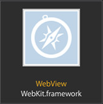
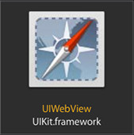

YSWebView
=========
[](https://travis-ci.org/YardiSystems/YSWebView)
[](http://cocoadocs.org/docsets/YSWebView/)
[](http://cocoadocs.org/docsets/YSWebView/)
[](https://www.apache.org/licenses/LICENSE-2.0.html)

YSWebView wraps a webview, [UIWebView](https://developer.apple.com/library/ios/documentation/UIKit/Reference/UIWebView_Class/) or [WKWebView](https://developer.apple.com/library/ios/documentation/WebKit/Reference/WKWebView_Ref/) based on the OS availability.

<p align="left" >


</p>

## How to get started

### install via CocoaPods
```ruby
platform :ios, '7.0'
pod 'YSWebView'
```

### example
```objectivec
#import <YSWebView.h>
...

YSWebView *webView = [[YSWebView alloc] initWithFrame:frame];
[self.view addSubview:webview];

[webView loadRequest:[NSURLRequest requestWithURL:[NSURL URLWithString:@"http://www.yardi.com"]]];
OR
NSString *htmlString = @"<html><body><h1>title</h1></body></html>";
[webView loadHTMLString:htmlString baseURL:baseUrl];
```

## Requirements

- Xcode4 and above
- iOS 7.0 or above

## Author
- [Bogdan Hapca](bogdan.hapca@yardi.com)

## License
- YSWebView is available under the [MIT license](LICENSE).
